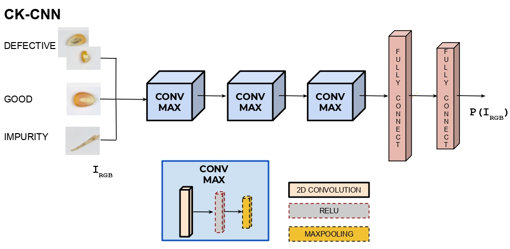
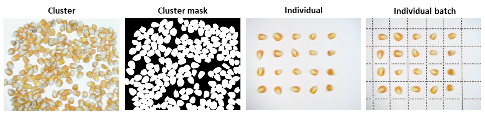

Before starting to use this project,  there are some requirements to fullfill.

## Requirements

* [Python 3.7.3](https://www.python.org/downloads/release/python-370/g)
* [TensorFlow=1.14](https://www.tensorflow.org) 
* [Keras 2.3.1](https://keras.io/#installation)
* [OpenCV](https://pypi.org/project/opencv-python/)
* [Matplotlib](https://matplotlib.org/3.1.1/users/installing.html)
* [Numpy](https://numpy.org/devdocs/user/install.html)

Once the packages are installed,  clone this repo as follow: 

    git clone https://github.com/cidis/CK-CNN.git
    cd code
    
# Deep learning based Corn Kernel classification

<!-- ```diff
- Sorry for any inconvenience, we are updating the repo
``` -->

This work presents a full pipeline to classify sample sets of corn kernels. The proposed approach follows a segmentation-classification scheme. The image segmentation is performed through a well known deep learning-based approach, the Mask R-CNN architecture, while the classification is performed through a novel-lightweight network specially designed for this task: CK-CNN ---good corn kernel, defective corn kernel and impurity categories are considered. To know more about CK-CNN, read our camera ready version in [ckcnn](http://www.cidis.espol.edu.ec/es/content/deep-learning-based-corn-kernel-classification), this paper will be presented in The 1st International Workshop and Prize Challenge on Agriculture of CVPR2020.

## Segmentation 
To segment the elements for a further classification. the Mask R-CNN network is trained This [implementation](https://github.com/matterport/Mask_RCNN) of the Mask R-CNN network has been used to perform the image segmentation. This architecture generates bounding boxes and segmentation masks for each instance of the corn kernel and impurity present in the given image. This implementation is based on ResNet-101 as a backbone and pre-trained COCO weight

## Classification
A novel-lightweight architecture is proposed to classify a given element into some of the following classes: good corn, defective corn (including broken and rotten corns) and impurity. The proposed architecture, referred to as CK-CNN, receives as an input a single element from the segmentation algorithm and consists of five layers: three convolutional layers defined with a 3 X 3 size kernels and two fully connected layers. The model uses a cross-entropy loss function to measure the performance of the classification model. Also, the model includes a RELU activation function after each convolution and a max pool layer to summarize the results of the convolution operation. The last two layers are fully connected, the first one receives the output of the last convolutional layer, which allows all the outputs of the convolution operation to be connected, as was done in the multilayer perceptron (MLP) technique. The last fully-connected layer enables the class score using the softmax activation function, to obtain the probability distribution that corresponds to each class type. 

The proposed model supports the n-class classification problem. In our case, this model has been used for a 2-class classification (good or defective corn kernels) and for a 3-class classification (good corn kernels, defective corn kernels and impurity). The CK-CNN network has been trained from scratch using Nesterov ADAM (NADAM) optimizer with a learning rate of 0.0002, which provides a faster convergence and generalization of the model. 

<div align="center" style="text-align:center">
    
</div>


## Table of Contents
* [Project architecture](#architecture)
* [Datasets](#datasets)
* [Performance](#performance)
* [Citation](#citation)


## Project Architecture

```
├── data                           # sample images for training and testing
|   ├── clusters                   # samples for segmentation experiment
|   └── individual                 # samples for classification experiment
├── figs                           # Images used in README.md
|   └── ckcnn_architecture.jpg     # ckcnn banner for model architecture
|   └── dataset_example.png        # dataset example banner
|   └── maskrcnn_architecture.png  # mask r-cnn banner for model architecture
├── models                         # keras model file  
|   └── weights.h5                 # weights saved for the ck-cnn test in paper
├── code                           # a series of tools used in this repo
|   └── ckcnn_2class.py            # python file with main functions and parameter settings for 2 class classification
|   └── ckcnn_3class.py            # python file with main functions and parameter settings for 3 class classification 
|   └── Prediction.py              # the script to run testing experiment and generation of statistics
```

As described above, ckcnn_2class.py and ckcnn_3class.py has the parameters settings, for training ckcnn for 2 class and 3 class classification experiments respectively, before those processes the parameters need to be set. CKCNN is trained with our proposed dataset attached uin the respective section, so make sure to change the route to the right one; however, in the testing stage (Prediction.py), any dataset can be used. However, we evaluated with our proposed "validation" dataset and the arguments have to be well referenced. If you want to experiment with our trained weights, just change the load_model function parameter and set the one is in the model directory on this repo. Pay attention in the parameters' settings, and change whatever you want. 

```
saved_model = load_model("weights.h5")
test_data_generator = test_generator.flow_from_directory(
    directory="datasetD/validation_set/validation_set", # Put your path here
    target_size=(224,224),
    #batch_size=32,
    shuffle=False)
```

# Datasets

<div style="text-align:center">
 
## Dataset used for both Training and Testing

This dataset is collected and annotated in our laboratories following high quality standards for image adquisition.
See more details and download in: [Option1](http://www.cidis.espol.edu.ec/es/content/deep-learning-based-corn-kernel-classification)

# Performance

The results below are from the final version of CKCNN compared with other well-known architectures trained with our datasets. 

GCA: Good corn accuracy\
DFA: Defective corn accuracy\
IMP: Impurities accuracy\
AVG: overall accuracy\
PAR: Total number of parameters in K\

<center>

|     Network    |    GCA   |    DFA   |    IMP   |    AVG   |   PAR(K)  |
| -------------- | ---------| -------- | -------- | ---------| --------- |
| [CKCNN(ours)](https://github.com/cidis/CK-CNN/)            | `.979` | `.900` | `.973` | `.956` |    `3306` |
| [VGG-16](https://github.com/1297rohit/VGG16-In-Keras)      | `.974` | `.876` | `.819` | `.890` | `134.272` |
| [RESNET-50](https://github.com/s9xie/hed)                  | `.986` | `.860` | `.931` | `.925` |   `23593` |
| [MASK-RCNN](https://github.com/matterport/Mask_RCNN)       | `.960` | `.695` | `.286` | `.647` |   `63738` |

</center>
Evaluation performed with our provided dataset. Fine-tuning is in progress, we will update the results soon.

# Citation
Please cite our paper if you find helpful,
```
@inproceedings{corn2020ckcnn,
  title={Deep Learning based Corn Kernel Classification},
  author={Velesaca, Henry O. and Mira, Raúl and Suarez, Patricia L. and Larrea, Christian X. and Sappa, Angel D.},
  booktitle={The 1st International Workshop on Agriculture-Vision: Challenges & Opportunities for Computer Vision in Agriculture},
  pages={},
  year={2020},
  organization={}
}

Mask R-CNN
@inproceedings{he2017mask,
  title={Mask r-cnn},
  author={He, Kaiming and Gkioxari, Georgia and Doll{\'a}r, Piotr and Girshick, Ross},
  booktitle={Proceedings of the IEEE international conference on computer vision},
  pages={2961--2969},
  year={2017}
}
```


